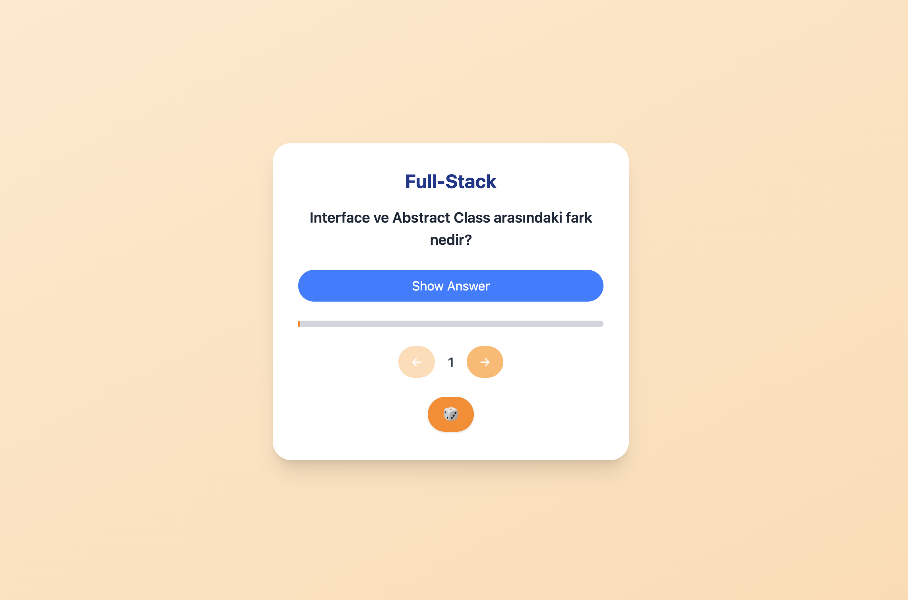

# 🎓 Mülakat Hazırlık Kartları

React tabanlı bu uygulama, Full Stack Developer mülakatlarına hazırlanan geliştiriciler için sıkça sorulan teknik soruları sade ve etkili bir kart sistemiyle sunar.

---

## 📌 Proje Özeti

Kategorilere ayrılmış sorular arasında ileri/geri geçiş yaparak çalışmayı kolaylaştıran bu uygulama sayesinde mülakatlara her an her yerden hazırlanabilirsiniz. Basit tasarımı ve işlevsel yapısı ile kullanıcı dostudur.

---

## 🧠 Özellikler

- 🔄 **İleri/Geri Navigasyon:** Sorular arasında gezinme
- 👁 **Cevabı Göster/Gizle:** Önce düşün, sonra kontrol et
- 📱 **Mobil Uyumlu Tasarım:** Tüm cihazlarda sorunsuz kullanım

---

## Uygulama Linki
https://fullstack-quiz-five.vercel.app/

## 🖼️ Uygulama Ekran Resmi

